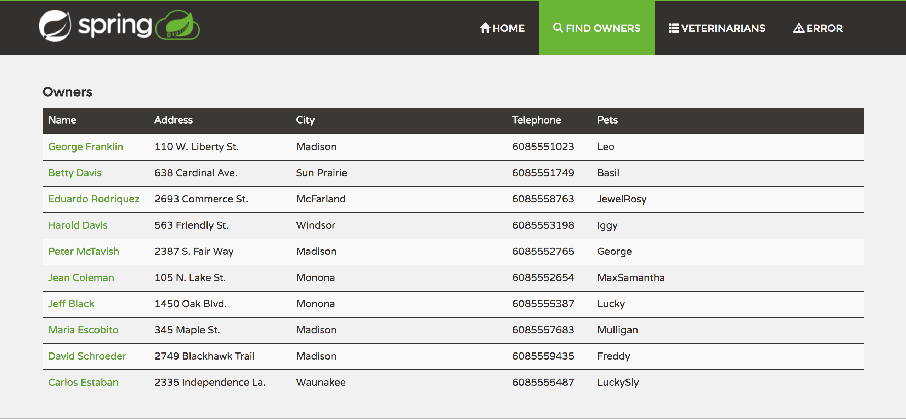
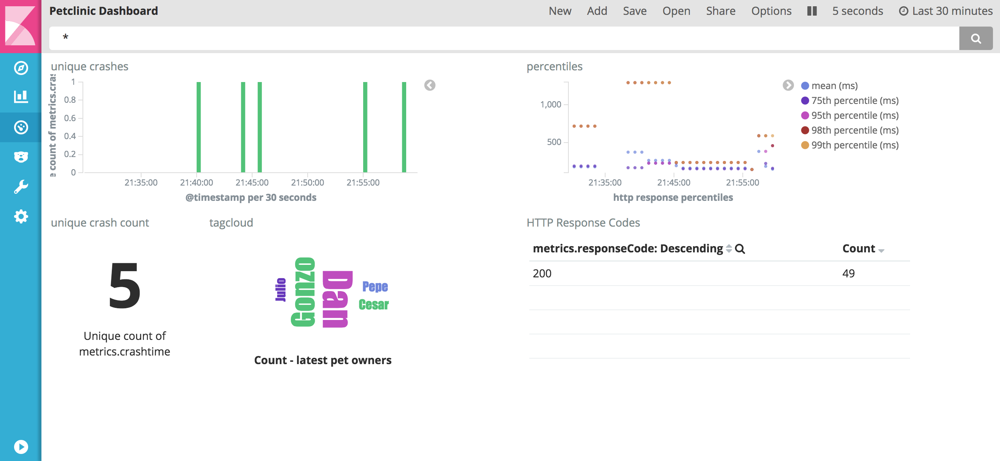

## APEX Petclinic Demo

APEX extracts contextual data and metrics directly from your Java application.

It helps getting better visibility and understanding of what is happening in the software products' application layer during runtime. Designed to accelerate application analytics, debugging and monitoring.

This demo configuration will spin up preconfigured docker containers to play with APEX and Spring Petclinic:

* Spring Petclinic with APEX installed
* apexbeat (fowarding APEX messages to Elasticsearch)
* Elasticsearch
* Kibana

To run this demo you need docker and docker-compose installed.

### Installation and Setup

Clone the repository

----
git clone https://github.com/verticle-io/apex-petclinic-demo.git
----

Head into the cloned repo and run the stack

----
cd apex-petclinic-demo

docker-compose up
----

If you would like to use the preconfigured dashboard:
Go to Kibana Management->SavedObjects and import the file `kibanaconfig/export.json`

### Things to check out

#### APEX reactions

Apex will react on

* all HTTP requests to petclinic (http://127.0.0.1:8080) measuring performance and recording HTTP response states.
* creation of new pet owners (recording their names)
* creation of new pets (dumping complete instance contexts)

#### Container logs

View the logs of petclinic and watch out for outputs with "<APEX>".
You should see target class instrumentations and handler invocations there.

#### Kibana

Open Kibana on http://localhost:5601 and explore the gathered metrics.

#### Instrumentation
Visit the instrumentation configuration in folder `apexconfig`.
Check out the individual JSON files containing target instructions.

The handlers used in this example are

* `BasicPerformanceHandler` - measures method executions
* `BasicScriptedHandler` - runs groovy scripts to extract data
* `BasicContextDumpHandler` - dumps complete class instances

Changes applied to groovy scripts will be automatically reloaded.
Changes applied to json files will reload on restart of the VM.

Happy hacking!

### More on APEX

Visit http://toolkits.verticle.io for docs.
